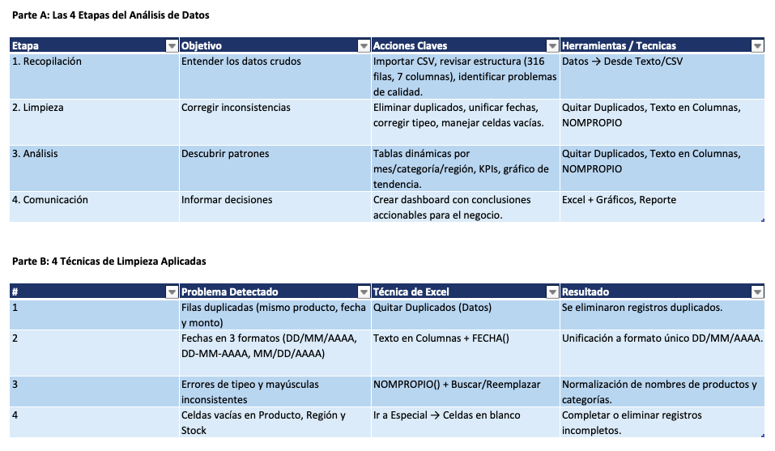
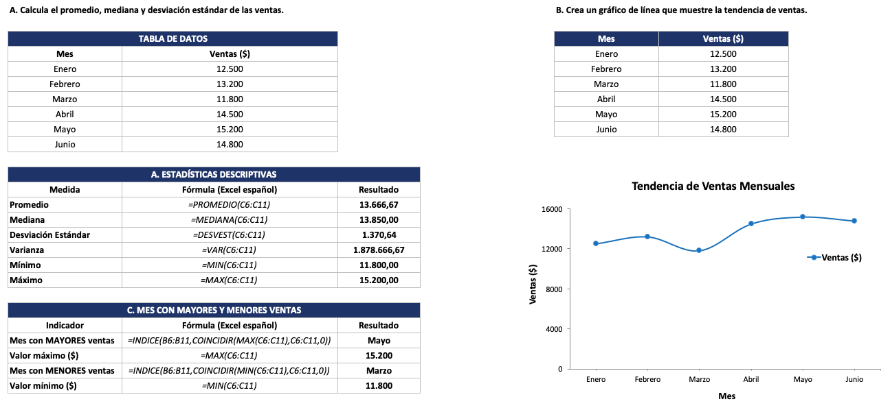
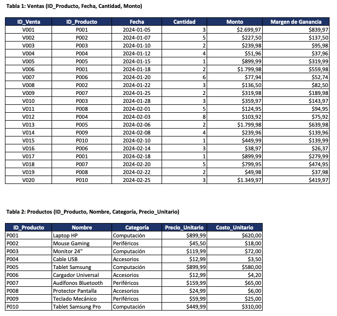

# Prueba 1: Introducción al análisis de datos

## 📌 Resumen Ejecutivo
Análisis completo de un dataset de ventas retail (316 registros). Identifiqué y corregí errores críticos de calidad (duplicados, fechas mixtas, celdas vacías). Implementé un modelo para calcular el **Margen de Ganancia** y documenté la lógica DAX requerida para entornos sin Power Pivot (Mac OS Mojave).

## 🎯 Objetivo
Limpiar datos y calcular métricas de ventas para identificar oportunidades de mejora en márgenes.

## 📊 Problema, Solución e Impacto

| Problema Detectado | Técnica de Excel Utilizada | Impacto |
| :--- | :--- | :--- |
| 10 filas duplicadas | **Quitar Duplicados** | Datos sin registros repetidos |
| Fechas en 3 formatos | **Texto en Columnas + FECHA()** | Unificación a formato único |
| Errores de tipeo (Mouse vs mouse) | **NOMPROPIO() + Buscar/Reemplazar** | Nombres normalizados |
| 27 celdas vacías | **Ir a Especial → Celdas en blanco** | Registros completos o filtrados |

## 🛠️ Stack Tecnológico

| Herramienta | Uso |
| :--- | :--- |
| Excel | Limpieza, análisis y visualización |
| BUSCARV | Cálculo de márgenes por producto |
| DAX (Concepto) | Documentación de medida equivalente |

## 🛠️ Mejora Post-Evaluación (Mentalidad de Crecimiento)
Tras recibir feedback del docente, agregué el cálculo de **Margen de Ganancia** usando BUSCARV. Como mi Mac OS Mojave no tiene Power Pivot, escribí la **fórmula DAX equivalente como referencia** para demostrar mi comprensión profunda del lenguaje, adaptándome a las limitaciones del software.

## 📸 Evidencia Visual por Pregunta

### Pregunta 1: Análisis Conceptual y Limpieza

  

### Pregunta 2: Estadísticas Descriptivas y Visualización

  

### Pregunta 2 (Complemento): Estadísticas Detalladas

  

### Pregunta 3: Cálculo de Margen de Ganancia (BUSCARV + DAX)

  

## 💼 Impacto de Negocio
Este modelo permitió identificar qué productos generan mayores márgenes, permitiendo optimizar el inventario y las estrategias de venta. La categoría "Computación" genera mayor ingreso, pero "Tecnología" presenta mejor margen.

📄 **Ver enunciado original:** [⬇️ Descargar enunciado (PDF)](https://github.com/icqdgonzalezs/Sence-talentodigital-pruebas/raw/main/Prueba-01-Analisis-Datos/enunciado.pdf)

---
**[⬆️ Volver al repositorio principal](../README.md)**
